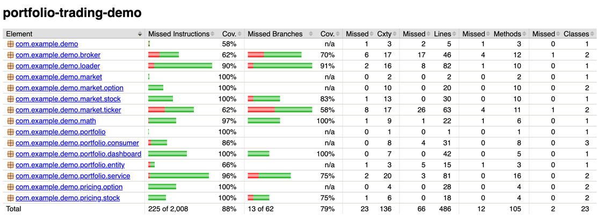

# Portfolio Trading Demo

This is a demo application.

## Tech Stack

- JDK 1.8
- Spring Boot 2.7
- H2
- Gradle
- Protobuf 4.28.3

## Gradle Plugins

- protobuf (for compile .proto file)
- Jacoco (for code coverage)
- Spotless (for code formatting)

## How to run?

make sure at the project root directory, and run following command in shell.

```shell
./gradlew bootRun
```

## Sample data

to demo this application, would need following csv files in the designed csv folder in project root directory.
if want to change the file content, please make sure following the csv headers.

```shell
cat csv/sample-options.csv

symbol,strikePrice,maturity(years),symbolType,stockSymbol
AAPL-OCT-2020-110-C,200,1,2,AAPL
AAPL-OCT-2020-110-P,400,1,3,AAPL
TELSA-NOV-2020-400-C,180,1,2,TELSA
TELSA-DEC-2020-400-P,260,1,3,TELSA

```

```shell
cat csv/sample-portfolio.csv

symbol,positionSize,stockSymbol
AAPL,1000,
AAPL-OCT-2020-110-C,-20000,AAPL
AAPL-OCT-2020-110-P,20000,AAPL
TELSA,-500,
TELSA-NOV-2020-400-C,10000,TELSA
TELSA-DEC-2020-400-P,-10000,TELSA

```

```shell
cat csv/sample-stock.csv

symbol,price,expected_return,deviation
AAPL,300.5,0.2,0.123
TELSA,200.2,0.3,0.234

```

## Configuration

to demo this application, also having follow configuration prepared.

```yaml

app:
  portfolio-relative-path: csv/sample-portfolio.csv # relative file path to project root directory
  stock-relative-path: csv/sample-stock.csv # relative file path to project root directory
  option-relative-path: csv/sample-options.csv # relative file path to project root directory

market:
  quote-producer-thread.enabled: true
  broker-dispatch-thread:
    enabled: true
    timeout: 10
  risk-free-interest-rate: 2 # for calculate option's price

```

## Code Coverage



## Format Code

please ensure JAVA_HOME point to JDK 1.8.

```shell
./gradlew spotlessApply
```

## Build application with unit test

please ensure JAVA_HOME point to JDK 1.8.

```shell
./gradlew build
```

